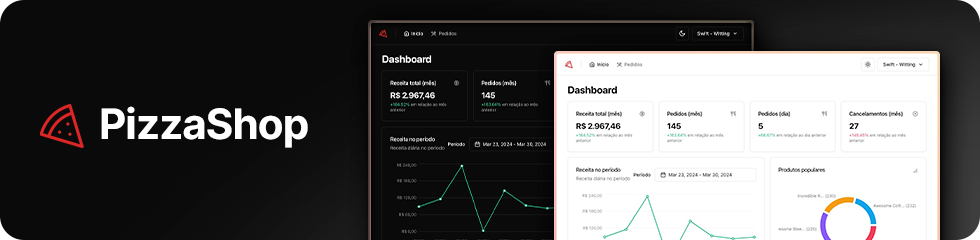

# PizzaShop

Dashboard para administração e gerenciamento de pedidos de delivery desenvolvido no curso de Desenvolvimento Full Stack da Rocketseat, contando com métricas e gráficos de pedidos e faturamento.

A aplicação utiliza estratégia de cache nas requisições, reduzindo o uso de recursos da API e melhorando a perfomance e experiência ao usuário. Também conta com testes unitários e E2E utilizando mocks.

Acesse a API do projeto [neste link](https://github.com/julianosill/bun-pizzashop-api).

## Tecnologias e bibliotecas


## Funcionalidades

- Registro e atualização do perfil do restaurante
- Listagem de pedidos
- Aprovação, envio, conclusão e cancelamento de pedidos
- Visualização dos detalhes do pedido e cliente
- Visualização de métricas e gráficos

## Instalação e execução local

Clone este repositório, acesse a pasta do projeto e instale as dependendências necessárias seguindo os comandos abaixos:

```bash
git clone https://github.com/julianosill/ignite-pizzashop-web.git
cd ignite-pizzashop-web
pnpm install
```

Crie dois arquivos chamados `.env.local` e `.env.test` (ou renomeie os aquivos `env.local_sample` e `env.test_sample`) na pasta raíz do projeto seguindo o padrão abaixo:

```bash
# .env.local
VITE_API_URL="url_da_api"
VITE_ENABLE_API_DELAY=false

# .env.test
VITE_API_URL="/"
VITE_ENABLE_API_DELAY=false
```

Em seguida, inicie a aplicação com o comando:

```bash
pnpm dev
```

## Acesso ao painel administrativo

Acesse a página inicial ou `/sign-in`, exemplo: [http://localhost:5173](http://localhost:5173) ou [http://localhost:5173/sign-in](http://localhost:5173/sign-in), e utilize o e-mail `admin@admin.com`.

Esta aplicação não está configurada para envio de e-mails. Após a tentativa de login, confira o terminal onde a API da aplicação estiver rodando e copie a URL exibida nele em seu navegador.

Você será direcionado à página inicial do painel automaticamente.